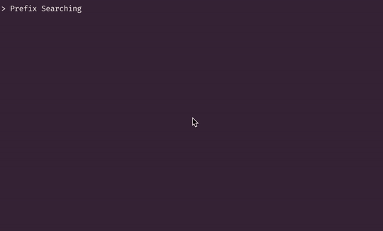

# Exercises in Text Prediction



## Goal
To create a word suggestion tool based upon prefixes

## Success Criteria
* Level 0: Prefix Searching
* Level 1: Trie-ing Harder
* Level 2: The Great Filter 
* Level 3: Fuzzy Finding for Fat-Fingered Friends
* Level 4: Improvements

## Setup
First, I need some words. The system dictionary "/usr/share/dict/words" is pretty good, but it has 236k words whereas this English word frequency [dataset](https://www.kaggle.com/rtatman/english-word-frequency/version/1#) from Kaggle has more words as well as their frequencies.

> This dataset contains the counts of the 333,333 most commonly-used single words on the English language web, as derived from the Google Web Trillion Word Corpus.

The data comma-separated "word,freq" but I'm going to convert to json for quick loading (marshaling) into memory (Go map). Also, I'm going to replace the frequency count with the word's commonality ranking because I will be using a minheap and rankings give more context -- knowing how many times a word occurred in the corpus doesn't explicitly tell you its commonality relation to the 333k other words.

```
# Get list of words for building trie
awk -F , '{print $1}' original-dataset.csv > words.txt

# The words are in order by frequency -> the line number is the word's rank
awk -F , '
  BEGIN {print "{"}
  {printf "  \"%s\": %d,\n", $1, NR}
  END {print "}"}' words.txt > ranks.json

# trim the last trailing comma -- I could've used jq
```

## L0: Prefix Searching
How can we find all words that start with "a"? What about words that start with "pre"?
```
grep "^a.*" words.txt

grep "^pre.*" words.txt
```

## L1: Trie-ing Harder
A trie is a prefix tree where each node stores a set of child nodes with strings for the set's keys. String values are not stored in the nodes, but nodes are marked when they are the end of a word. For level 1, I will construct a trie from the dictionary (words.txt) and use that trie as my search index. 


```{golang}
type Node struct {
  Children map[string]*Node
  IsWord   bool
}
```

### Trie Construction
This method is straightforward. I iterate over the words, then iterate over the word's characters. I walk the trie character-by-character and create nodes when necessary. The last node corresponds to the last character of the word, so this node is marked with `isWord = true`.
```
for word in words.txt
  for character in word
    // traverse trie and set to current node
    if (node does not exist for this character)
      // create node and mark as current
  // mark current node as a word
```

### Prefix Search
Search is similar to construction. Given a prefix, I walk the trie character-by-character. Once I have walked to the end of the prefix, I perform an unbounded search on the sub-trie and accumulate characters to form partial words. If I find a node marked as a word, I add the current value of the accumulator to the results list.

## L2: The Greater Filter
I can now return all of the words which share a common prefix, but I'd rather have fewer suggestions. I will filter for the most common words.

### Word Frequency
Transforming the kaggle dataset into json makes this easy with `json.Marshal`.

### Marshal
```{golang}
func GetWordRanks(ranksFilePath string) map[string]int {
	ranks := make(map[string]int)
	bytes, _ := ioutil.ReadFile(rankFilePath)
	_ = json.Unmarshal(bytes, &ranks)
	return ranks
}
```

### Min Heap
Heaps are great for quickly returning *n* values in order. Using a heap makes return the most common words simple.

```{golang}
func CommonWords(ranks map[string]int, words []string, n int) []string {

	h := &wordHeap{}
	heap.Init(h)

	// Add all words to the heap log(n) time
	for _, w := range words {
		heap.Push(h, &word{
			text: w,
			rank: ranks[w],
		})
	}

	heapLen := h.Len()
	if heapLen < n {
		n = heapLen
	}

	// Return top n words from the heap
	results := make([]string, n)
	for i := 0; i < n; i++ {
		results[i] = (*h)[i].text
	}
	return results
}
```

## Fuzzy Finding For Fat-Fingered Friends
I will attempt to improve the search by fuzzing prefixes. I can do this by defining a set of boundary characters for each key on the keyboard and searching the trie with those boundary characters. For example, the boundary characters of `"a"` on a qwerty keyboard are `{"q", "w", "s", "z"}`. These are the characters that are likely to be accidentally typed instead of `"a"`.

The fuzzy trie search is done, for now, in two steps.

### Setup the DFS
I search the trie for each permutation of the given prefix. I permute each character with its boundary characters. Once I reach a permutation that exists in the trie, I add it to the stack for the depth first search.

### DFS
The DFS is the exact same as the standard prefix search from before. I search through the trie and add each word I encounter to the results list.

### Why this isn't good?
Efficiency aside, this isn't good because the permutations of a prefix result in searches for prefixes that often have more common words than the words for the given prefix.

**Example**: cat
This should return categories, catalog,  category, ... in that order. However, "date" is the top result because "dat" is a prefix permutation of "cat" and it is more common than all of the results with the prefix "cat".

This fuzzing method assumes that typing accuracy is evenly distributed amongst the intended character and its boundary characters. In practice, people's typing accuracy is much higher than ~20% (I sure hope it is). I need to account for a permutation's edit distance to the prefix in the results ranking.

## Fuzzy Searching with Edit Distance and Commonality Ranking Filters
I've added the edit distance filter to **Setup the DFS** step of the fuzzy trie search. Doing this increases performance because I will not search down trie paths for words I would later filter out.

The rule is simple, yet effective. I only search for words whose permuted prefix has an edit distance less than or equal to 20% of the input prefix's length (with rounding). For example, if you prefix is 6 characters long, the search will include results whose prefix differs by up to 2 characters.  In code:

```
if editDistance(permutedPrefix) <= 0.2 * len(inputPrefix) {
  // add to stack for the DFS
}
```

This assumes ~80% typing accuracy which seems low for physical keyboards but fair for touch keyboards. Also, keeping the assumed typing accuracy low increases the fuzziness of the search which also helps with spelling mistakes.

